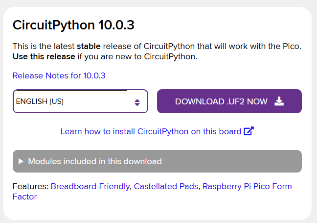

# 鼠标移动模拟器

一个运行在 Raspberry Pi Pico 上的自然鼠标移动模拟器，用于模拟人类的鼠标行为，使其看起来更自然、更真实。

## 硬件要求

- Raspberry Pi Pico (RP2040)
- 可选：WS2812 LED (连接到 GP16)，用于指示当前模式

## 功能

模拟自然的人类鼠标移动行为，包括多种移动模式和非匀速运动。

## 特点

- 模拟人为自然的鼠标移动
- 多种移动模式（网页浏览、页面扫描、探索性移动随机移动、圆形移动、目标聚焦）
- 非匀速移动（加速-匀速-减速模式）
- LED 状态指示器

## 移动模式

1. **网页浏览模式**：模拟用户在网页上浏览时的鼠标行为，包括小范围移动和停留
2. **页面扫描模式**：模拟从左到右扫描页面的行为，模拟人类阅读模式
3. **探索性移动模式**：模拟用户在页面上随机探索的行为
4. **随机移动模式**：模拟用户随意移动鼠标的行为
5. **圆形移动模式**：鼠标沿圆形轨迹移动，模拟轻微的手部抖动
6. **目标聚焦模式**：模拟用户专注于某个区域的行为，包括微小移动

## 安装和使用

1. 将代码复制到 Raspberry Pi Pico 的 `code.py` 文件中
2. 确保安装了必要的库文件（`adafruit_hid` 和 `neopixel.mpy`）
3. 将 Pi Pico 连接到计算机，它将作为一个 USB 鼠标设备出现
4. 代码将自动运行并开始模拟鼠标移动

## LED 指示器颜色

- 绿色：网页浏览模式
- 蓝色：页面扫描模式
- 青色：探索性移动模式
- 紫色：随机移动模式
- 橙色：圆形移动模式
- 红色：目标聚焦模式

## 使用方法

### 下载和刷写 Circuit Python 固件

打开 https://circuitpython.org/board/raspberry_pi_pico/, 点击下载 CircuitPython 固件。

然后按住 BOOT 键，使用 USB 线连接 Raspberry Pi Pico 到电脑。

将 **.uf2** 文件复制到电脑上出现的 u 盘里。

### 写入程序

少些 UF2 文件后，将 Raspberry Pi Pico 插入电脑，然后复制 lib、boot.py 和 code.py 到 u 盘。

### 重新写入程序

写入程序之后， U 盘会自动关闭。
插入 usb 后连续点击两次 RESET 键可以重新打开存储模式, 将代码覆盖到存储器中。
